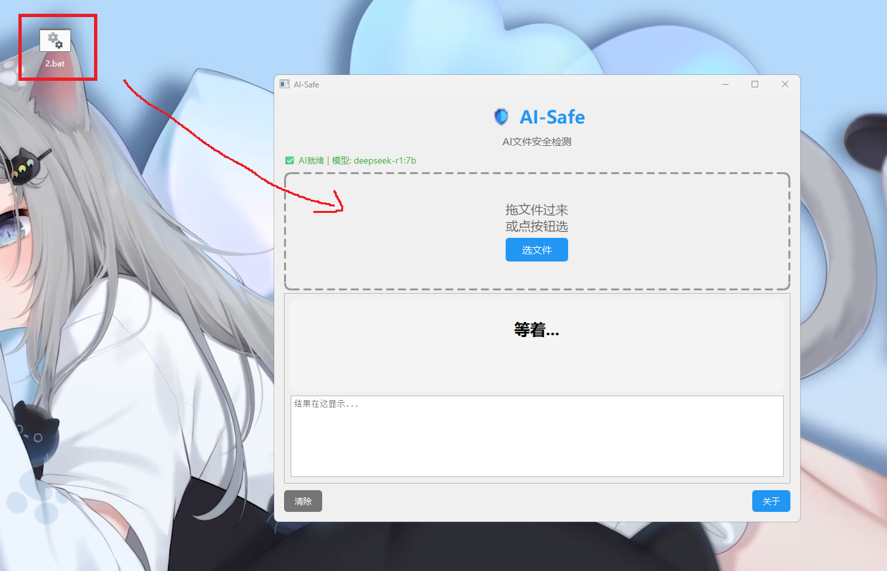
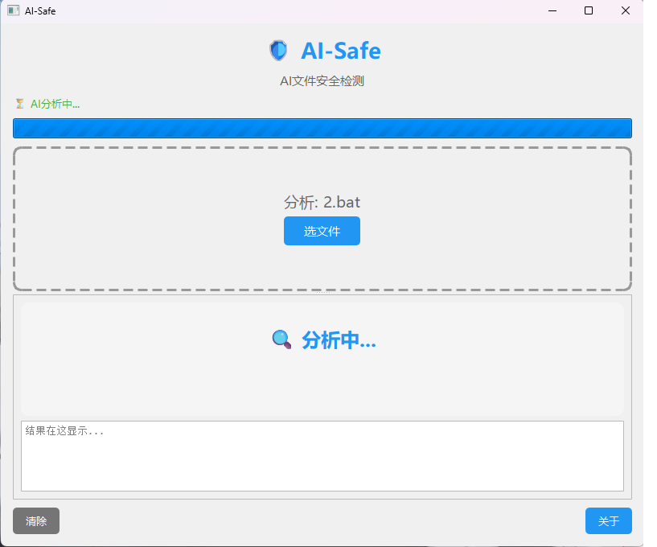
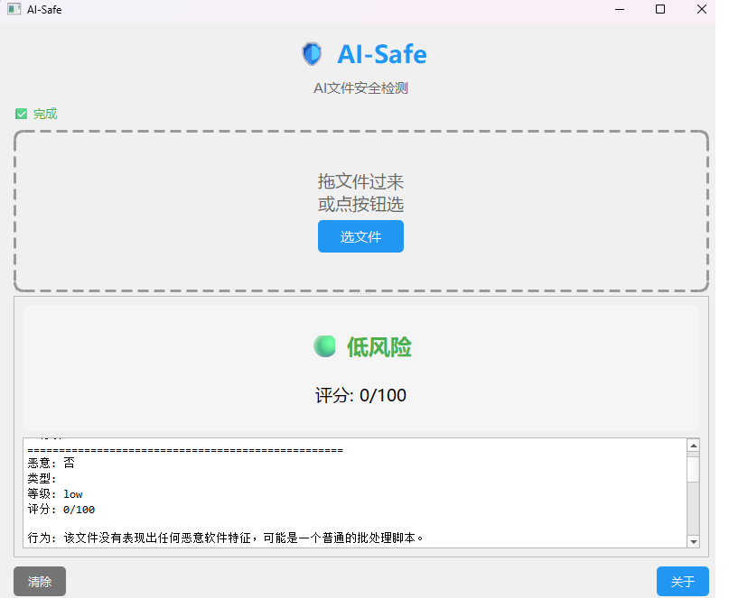
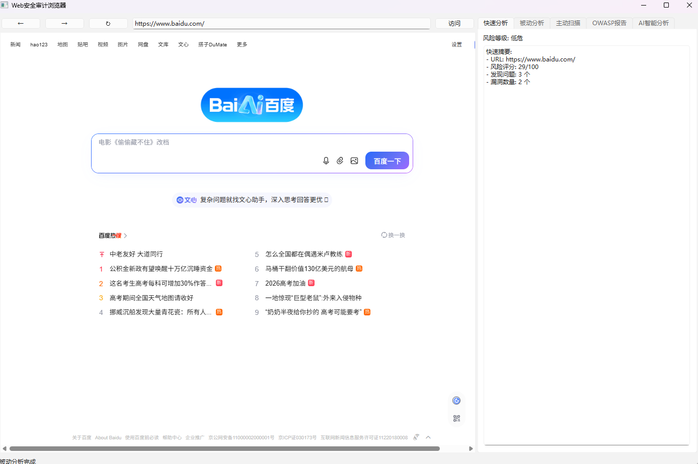
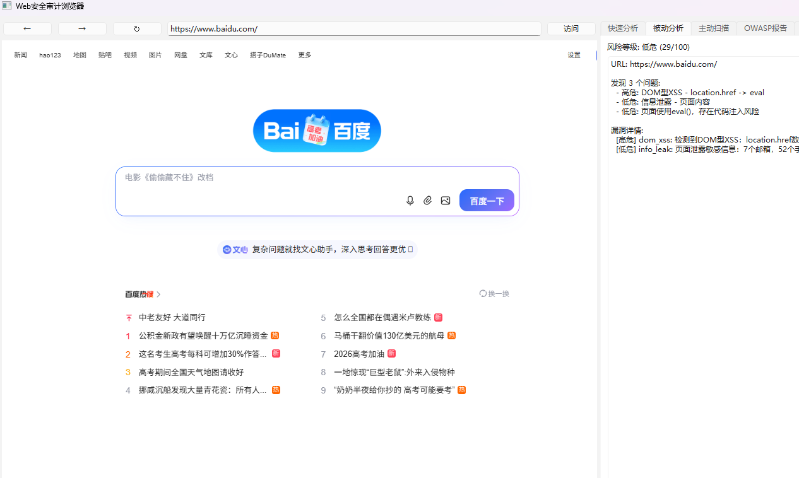
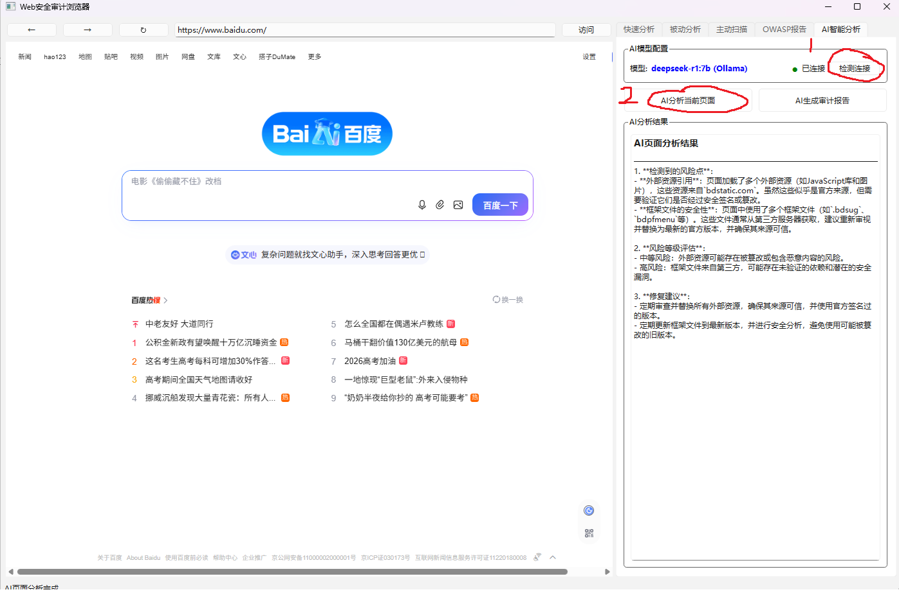

# AI-Safe

<div align="center">


**用 PyQt6 写的文件安全检测工具 + Web 安全审计浏览器，基于 Ollama 本地 AI 做语义分析。**

*本地运行，不上传文件，保护隐私。*

</div>

---

## 目录

- [简介](#简介)
- [功能特性](#功能特性)
- [快速开始](#快速开始)
- [项目结构](#项目结构)
- [使用说明](#使用说明)
- [技术架构](#技术架构)
- [更新日志](#更新日志)
- [免责声明](#免责声明)

---

## 简介

AI-Safe 包含两大核心模块：

| 模块 | 说明 |
|------|------|
| **文件安全检测** | 拖入文件或文件夹，AI 语义分析是否为恶意软件。本地运行，不上传文件。 |
| **Web 安全审计浏览器** | 内置浏览器访问目标网站，被动分析 + 主动扫描 + AI 生成安全报告。 |

### 支持的文件类型

| 类型 | 扩展名 |
|------|--------|
| PE 文件 | `.exe` `.dll` `.sys` `.scr` |
| 脚本文件 | `.bat` `.cmd` `.ps1` `.vbs` `.js` `.py` `.jar` `.sh` |

---

## 功能特性

### 模块一：文件安全检测

- 拖放文件分析（Drag & Drop）
- AI 语义分析风险等级
- 静态特征提取（熵值、API 调用、字符串分析）
- 规则匹配检测（PowerShell 下载执行、注册表自启、键盘记录等）
- 文件夹批量扫描 + 白名单机制（降低误报）

### 模块二：Web 安全审计浏览器

- 内置浏览器访问目标网站（基于 PyQt WebEngine）
- **被动分析**：SSL 证书、HTTP Headers、表单分析、JS 动态脚本、CORS 配置
- **主动扫描**（架构 v2.0）：
  - 自动爬虫发现端点（链接 / 表单 / JS API / GraphQL）
  - SQL 注入：Error-based + Boolean-blind（三向 Diff 引擎）+ Time-based blind（统计方法）
  - XSS：源码反射检测 + 上下文感知 Payload + Playwright DOM 渲染验证
  - 自动 CSRF Token 处理
  - JSON API 支持（application/json）
  - Payload 自动变异（WAF 绕过）
- AI 综合生成安全审计报告

---

## 快速开始

### 1. 克隆项目

```bash
git clone https://github.com/yourname/ai-safe.git
cd ai-safe
```

### 2. 安装依赖

```bash
pip install -r requirements.txt
```

### 3. 安装 Ollama（本地 AI）

- 下载地址：[https://ollama.com](https://ollama.com)
- 推荐模型：`deepseek-r1:7b`（越大越强，需要更多内存）

```bash
ollama pull deepseek-r1:7b
```

### 4. 运行

```bash
# 文件安全检测
python run_safe.py

# Web 安全审计浏览器
python run_browser.py
```

---

## 项目结构

```
ai-safe/
│
├── ai_safe/                      # 文件安全检测模块
│   ├── __init__.py
│   ├── safe_gui.py               # 主界面
│   └── safe_scan.py              # 文件分析器（含白名单逻辑）
│
├── ai_web/                       # Web 安全审计浏览器模块
│   ├── __init__.py
│   ├── main_window.py            # 浏览器主界面
│   ├── ai_analyzer.py            # AI 分析器（Ollama）
│   └── payload_scanner.py         # 主动扫描器 v2.0
│       ├── ResponseDiffEngine    # 响应差异分析引擎
│       ├── CsrfHandler           # CSRF Token 自动处理
│       ├── RequestEngine         # 统一请求引擎（form+JSON）
│       ├── Crawler               # 自动爬虫
│       ├── PayloadMutator         # Payload 变异引擎
│       ├── ParameterAnalyzer      # 参数上下文分析器
│       ├── TimeBlindAnalyzer      # 时间盲注（统计方法）
│       └── Playwright Browser    # 浏览器验证
│
├── core/                         # 核心接口
│   ├── ai_interface.py            # 文件模块 AI 接口
│   └── web_interface.py           # Web 模块 AI 接口
│
├── cfg.yaml                      # AI 配置（模型 / 提示词 / 阈值）
├── run_safe.py                   # 文件检测入口
├── run_browser.py               # 浏览器入口
└── README.md
```

---

## 使用说明

### 文件安全检测

| 步骤 | 操作 |
|------|------|
| 1 | 启动程序，等待 AI 状态变为绿色（已连接） |
| 2 | 拖入文件或文件夹，或点击"选文件"按钮 |
| 3 | 查看分析报告（风险评分 + AI 语义分析 + 规则匹配结果） |

| 步骤 | 截图 |
|------|------|
| 启动并等待 AI 就绪 |  |
| 拖入文件分析 |  |
| 查看分析报告 |  |

### Web 安全审计浏览器

| 步骤 | 操作 | 说明 |
|------|------|------|
| 1 | 打开浏览器，输入目标 URL，点击"访问" | 自动加载目标页面 |
| 2 | 点击"开始扫描" | 执行被动分析 + 主动扫描 |
| 3 | 查看扫描日志 | 实时显示各阶段进度 |
| 4 | 点击"漏洞列表"查看详情 | 每条漏洞含类型、参数、Payload、置信度 |
| 5 | 点击"AI 汇总分析" | AI 根据扫描结果生成综合安全报告 |

| 步骤 | 截图 | 说明 |
|------|------|------|
| 访问目标网站 |  | 输入 URL → 访问 → 开始扫描 |
| 漏洞列表 |  | 查看详细漏洞信息 |
| AI 综合分析 |  | AI 生成完整安全审计报告 |

---

## 技术架构

### Web 扫描器架构（v2.0）

```
ActiveScanner（主控）
  ├─ Crawler              自动发现：链接 / 表单 / JS端点 / API路径
  ├─ CsrfHandler          自动提取并合并 CSRF Token 到 POST 请求
  ├─ RequestEngine         统一请求：form + JSON + auto
  ├─ PayloadMutator        Payload 变异：SQL 5维度 + XSS 9维度
  ├─ ParameterAnalyzer     上下文检测：html / attribute / js_string / url
  ├─ ResponseDiffEngine    三向比较：TRUE vs FALSE vs NORMAL（6维度分析）
  ├─ TimeBlindAnalyzer     时间盲注：3次采样 + 均值/标准差 + Z-score
  └─ Playwright Browser    DOM 渲染验证 + alert 弹窗捕获
```

### 扫描流程

```
阶段 0  爬虫发现端点（链接 / 表单 / JS API / GraphQL）
   ↓
阶段 1  SQL 注入 — Error-based + Boolean-blind（Diff Engine 三向比较）
   ↓
阶段 2  SQL 注入 — Time-based blind（3次采样 + Z-score 统计检验）
   ↓
阶段 3  XSS — 源码反射检测 + 上下文感知 Payload + 多层解码
   ↓
阶段 4  XSS — Playwright DOM 渲染验证（alert 弹窗捕获）
```

### 核心升级点（v1.0 → v2.0）

| 维度 | v1.0 | v2.0 |
|------|------|------|
| 响应分析 | 仅长度比较 | 三向 Diff Engine（6维度） |
| CSRF 处理 | 无 | 自动 GET+提取+合并 |
| JSON API | 不支持 | 支持 application/json |
| 爬虫 | 无 | 4类端点自动发现 |
| SQL Payload | 固定列表 | 5维度自动变异 |
| XSS Payload | 固定列表 | 9维度自动变异 + 上下文感知 |
| 时间盲注 | 单次差值判断 | 3次采样 + Z-score 统计 |
| 靶场专用逻辑 | 大量硬编码 | 完全移除 |

---

## 后续优化方向（Roadmap）

### 后续将重点完善现代 Web 场景的检测能力，包括：基于上下文的 XSS Payload 自适应生成、JavaScript Source→Sink 污点分析、Headless Browser 自动交互与 SPA 页面遍历、AST 级 JavaScript 解析替代正则匹配，以及 API 参数结构自动推断（JSON、GraphQL 等）。同时持续优化 Response Diff 算法与误报控制，提升复杂业务场景下的扫描准确率和自动化分析能力。


## 技术难点与挑战

### 1. 动态网站中的误报问题

传统扫描器仅通过：

```python
len(response.text)
```

比较响应长度，

在动态网站中误报率极高。

为降低误报，项目实现了：

- 三向响应比较（TRUE / FALSE / NORMAL）
- DOM 结构差异分析
- 状态码比较
- 重定向差异分析
- MIME 类型校验
- 安全关键字变化检测

用于提升 SQL 注入检测稳定性。

---

### 2. 时间盲注稳定性问题

网络波动容易导致 **Time-Based SQL Injection** 出现误报。

项目引入：

- 多次采样
- 基准均值建立
- 标准差分析
- Z-score 统计检验

用于降低网络抖动带来的误判。

---

### 3. 上下文相关 XSS 检测

现代 XSS Payload 强依赖注入上下文。

项目会先检测 **Payload 在响应中的反射位置**，

再根据：

- HTML Context
- Attribute Context
- JavaScript Context
- URL Context

动态选择 Payload，

而非使用固定 Payload 列表。

---

### 4. Payload 固定特征问题

传统固定 Payload 容易被 WAF 规则识别。

项目实现多维度 Mutation Engine：

- 大小写混淆
- 注释插入
- Unicode 编码
- URL 编码
- Tag Mutation
- Payload Split
- 空格替换

用于提升 Payload 多样性。

---

## 当前局限性（Limitations）

当前版本仍存在以下限制，请在使用时注意：

- 不适用于生产级渗透测试环境
- 对高级 WAF/CDN 防护绕过能力有限
- 尚未实现完整浏览器侧 Taint Tracking
- 复杂认证流程支持有限
- AI 分析结果仍可能存在误报
- DOM-Based XSS 检测能力仍不完善
- API Schema 推断能力仍在开发中
- 未实现动态沙箱执行能力

> **本项目仅用于安全研究、教学与授权测试环境。**

---

## 更新日志

### 2026-06-17
> **架构级升级 v2.0**
- 重写扫描器为 8 大独立组件架构（Crawler / CsrfHandler / RequestEngine / PayloadMutator / ParameterAnalyzer / ResponseDiffEngine / TimeBlindAnalyzer / Playwright Browser）
- 新增：爬虫发现端点 / CSRF Token 自动处理 / JSON API 支持 / Payload 自动变异引擎 / 上下文感知 XSS / 统计方法时间盲注 / 响应 Diff Engine
- 移除：所有 DVWA / 靶场相关硬编码逻辑，专注通用网站扫描
- 修复：扫描完成后闪退问题（ScanWorker 兼容 + try/except 隔离）

### 2026-06-12
- 新增：文件安全检测支持文件夹上传批量扫描
- 新增：文件安全检测集成白名单机制（路径 / 哈希 / 文件名），降低误报
- 修复：Web 审计浏览器扫描普通网站超时问题

### 2026-06-10
- 升级：Web 安全审计浏览器支持授权环境中的安全测试
- 升级：被动分析 + 主动扫描，准确率相比纯静态分析大幅提升

### 2026-06-17
- 新增：Web 安全审计浏览器模块（内置浏览器 / 被动分析 / AI 报告）
- 新增：杀毒模块新增 Fork 炸弹、删除系统文件、关闭防火墙等恶意规则检测

### 2026-06-28
- 升级：新增 Context-Aware XSS、ResponseDiffEngine、PayloadMutator、TimeBlindAnalyzer、JS Sink 分析、BrowserCrawler、API 参数发现等核心模块，优化误报控制、扫描稳定性与代码可维护性，进一步提升现代 Web 应用的漏洞检测能力。

---

## 免责声明

<div align="center">

**本项目仅供安全研究、教学与授权测试环境使用。**

请勿将其用于生产环境或未经授权的系统测试。AI 分析结果可能存在误报，请结合其他工具综合判断。

*For educational purposes only. Do not use as a production security tool. AI analysis results may produce false positives — use in combination with other tools for verification.*

</div>
